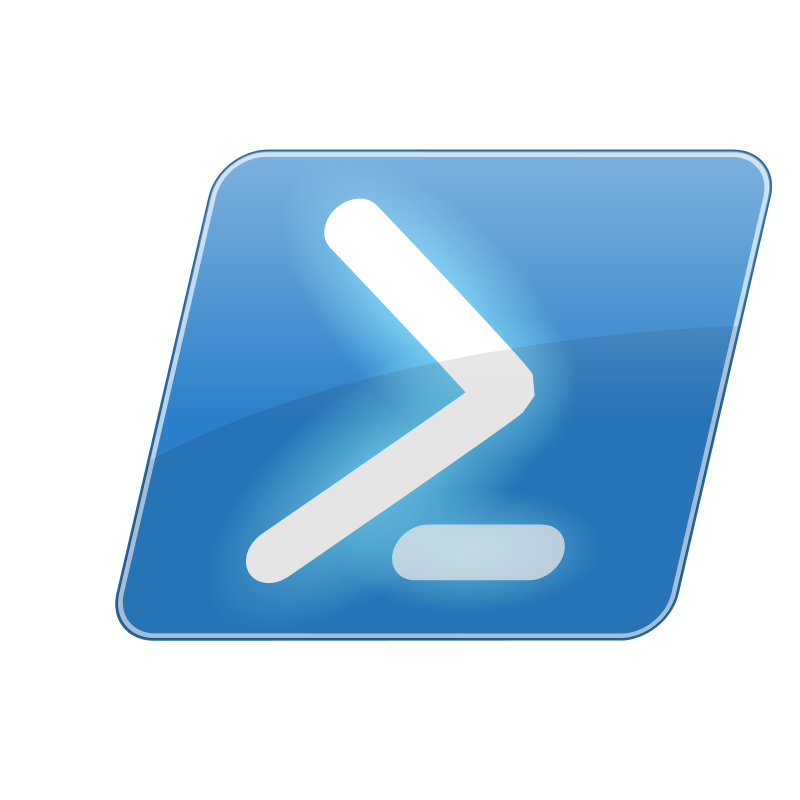

<br>

<!-- INSERT ICON AND TITLE -->
<div align="center">
  
  <a name="top"></a>
  <h3 align="center">PowerShell Examples</h3>
</div>

<br>

<!-- TABLE OF CONTENTS -->
<details>
  <summary>Table of Contents</summary>
  <ol>
    <li><a href="#Summary">Summary</a></li>
    <li><a href="#license">License</a></li>
    <li><a href="#contact">Contact</a></li>
    <li><a href="#contributions">Contributions</a></li>
    <li><a href="#instructions">Instructions</a></li>
  </ol>
</details>

<br><br>


<!-- SUMMARY -->
## Summary
A repository contains a collection of simple PowerShell coding examples to demonstrate PowerShell capabilities.

If you want to learn more about PowerShell, visit https://learn.microsoft.com/en-us/powershell/

<p align="right">(<a href="#top">back to top</a>)</p>

<br>

<!-- LICENSE -->
## License

Distributed under the Donegal ATU License. See `LICENSE` for more information.

<p align="right">(<a href="#top">back to top</a>)</p>

<br>


<!-- CONTACT -->
## Contact
* Name:  L00186132
* Email: L00186132.ATU@gmail.com

<p align="right">(<a href="#top">back to top</a>)</p>

<br>


<!-- Contributions -->
## Contributions
| Folder | Description | Notes
| ---|---|---
| 1. Install Powershell |  | 
| 2. PowerShell Coding |  | 
| 3. Remoting In Powershell |  | 

<p align="right">(<a href="#top">back to top</a>)</p>

<br>

<!-- Instructions -->
## Instructions
### Repository Instructions
* Clone repository
  ```sh
  git clone https://github.com/L00186132/Python.git
  ```
* Create your feature branch
  ```sh
  git checkout -b feature/branch
  ```
* Stage your changes
  ```sh
  git add <filename>
  ```
* Commit your changes
  ```sh
  git commit -am 'Add commit message'

  -a (commit all)
  -m (add message)
  ```
* Push branch changes to GitHub
  ```sh
  git push origin feature/branch
  ```
* Create a new Pull Request 
  ```sh
  https://github.com/L00186132/Python/pulls
  ```
* Pull latest GitHub repository changes to your local repository 
  ```sh
  git pull
  ```
<br>

### Useful Instructions 
* Check status
  ```sh
  git status
  ```
* List all local branches
  ```sh
  git branch
  ```
* List all remote branches
  ```sh
  git branch -r
  ```
* Delete a branche
  ```sh
  git branch -d <branchName>
  ```
* View Summary changes
  ```sh
  git log
  ```
* Preview changes before merging
  ```sh
  git diff <SourceBranch> <TargetBranch>
  ```
* Fork repository
  ```sh
  https://github.com/L00186132/Python/fork
  ```


<p align="right">(<a href="#top">back to top</a>)</p>